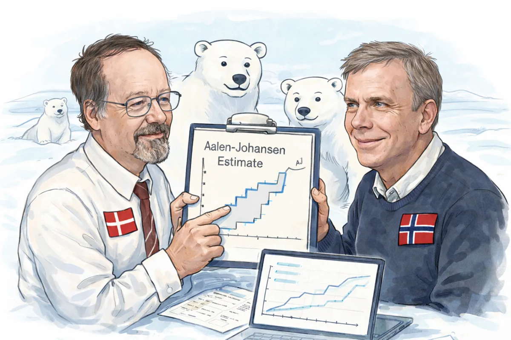

The Aalen-Johansen estimator generalizes Kaplan-Meier reasoning to one or more
absorbing outcomes. In `polarstate`, code `0` means that follow-up ended
without an observed event, code `1` is the event of interest, and optional
code `2` is a competing event.

{fig-alt="A watercolor illustration of Aalen and Johansen presenting state-occupancy curves, surrounded by polar bears." width=80%}

```{mermaid}
flowchart LR
    O["Under observation"] -->|"Code 0"| C["Right-censored"]
    O -->|"Code 1"| E["Event of interest"]
    O -.->|"Optional code 2"| R["Competing event"]
    style O fill:#dff3f8,stroke:#1f5f82
    style E fill:#e3f4ea,stroke:#287a4b
    style R fill:#f8e8ef,stroke:#9b4668
```

Codes `0` and `1` are sufficient for a single-event analysis. Code `2`
adds a second absorbing state; it is not required by the API.

## The estimator

For event type $j$, the estimated state-occupancy probability is

$$
\widehat F_j(t)
=
\sum_{u \le t}
\widehat S(u-)
\frac{dN_j(u)}{Y(u)}.
$$ {#eq-aalen-johansen}

Here, $Y(u)$ is the risk set immediately before time $u$, $dN_j(u)$ is the
number of type-$j$ events at that time, and $\widehat S(u-)$ is the probability
of remaining in state 0 immediately beforehand.

## From observations to estimates

The columns returned by `prepare_event_table()` expose each component of
@eq-aalen-johansen:

1. Observations are grouped by time and counted by outcome.
2. `at_risk` supplies $Y(u)$.
3. `csh_1` and `csh_2` supply $dN_j(u)/Y(u)$.
4. `previous_overall_survival` supplies $\widehat S(u-)$.
5. `trainsition_probabilities_to_*_at_times` contains each weighted increment.
6. `state_occupancy_probability_*_at_times` cumulatively sums those increments.

### Event-table columns

| Column | Interpretation |
|---|---|
| `times` | Unique observed time |
| `count_0` | Observations right-censored at that time |
| `count_1` | Events of interest at that time |
| `count_2` | Competing events at that time; zero in a single-event analysis |
| `events_at_times` | Total observations ending follow-up at that time |
| `at_risk` | Observations still under observation immediately before that time |
| `csh_1`, `csh_2` | Cause-specific event increments: event count divided by risk set |
| `conditional_survival` | Probability of avoiding either event at that time, conditional on being at risk |
| `overall_survival` | Product of conditional-survival increments through that time |
| `previous_overall_survival` | Survival immediately before the current time |
| `trainsition_probabilities_to_*_at_times` | Probability mass entering each absorbing state at that time |
| `state_occupancy_probability_*_at_times` | Cumulative probability of occupying each absorbing state |

The `trainsition` spelling is retained for compatibility with the current
public output schema.

## From the event table to requested horizons

`predict_aj_estimates()` performs a backward as-of join: for each requested
horizon, it returns the latest estimate available at or before that time.
Horizons before the first observed event receive probability 1 for state 0 and
0 for the absorbing states.

| Column | Interpretation |
|---|---|
| `times` | Requested horizon or observed event time |
| `state_occupancy_probability_0` | Probability of remaining event-free |
| `state_occupancy_probability_1` | Probability of the event of interest |
| `state_occupancy_probability_2` | Probability of the competing event |
| `estimate_origin` | Whether the row came from a requested horizon or the full event table |

At each horizon,

$$
P_0(t) + P_1(t) + P_2(t) = 1.
$$

For a single-event analysis, $P_2(t)=0$, so $P_0(t)$ is the Kaplan-Meier
survival estimate and $P_1(t)=1-P_0(t)$.

## Interpretation

A raw event proportion ignores how long each observation was followed.
Aalen-Johansen uses the risk set at each event time, so right-censoring removes
an observation from later risk sets without treating it as an event.

::: {.callout-important}
The estimates describe the observed cohort under the usual independent
censoring assumptions. They do not by themselves adjust for confounding or
establish causal effects.
:::

Continue with [Recipes](05-recipes.qmd) for common data structures, or consult
the [API Reference](../reference/index.html) for complete function details.
